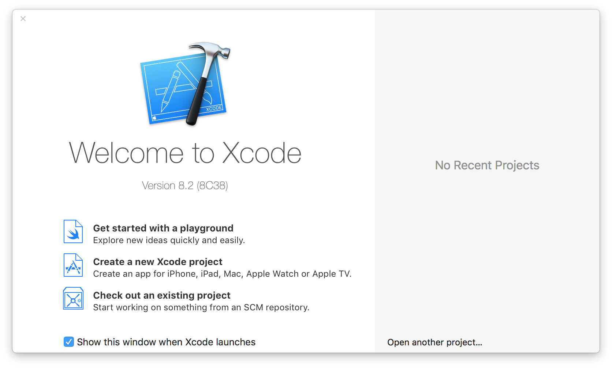
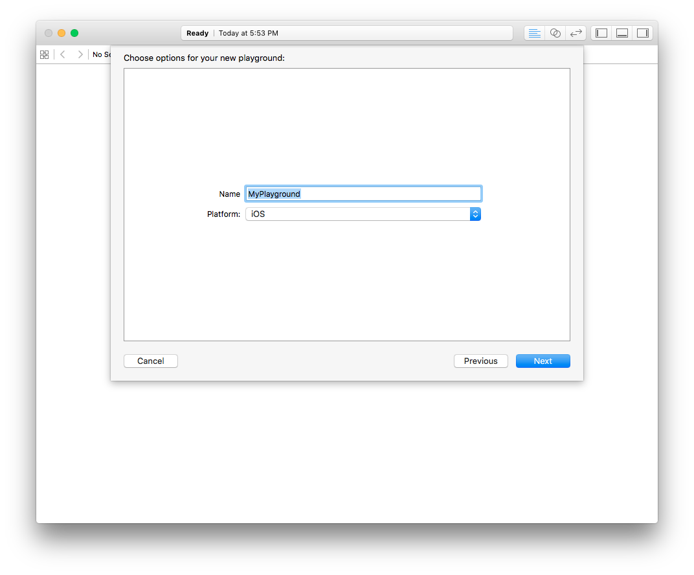
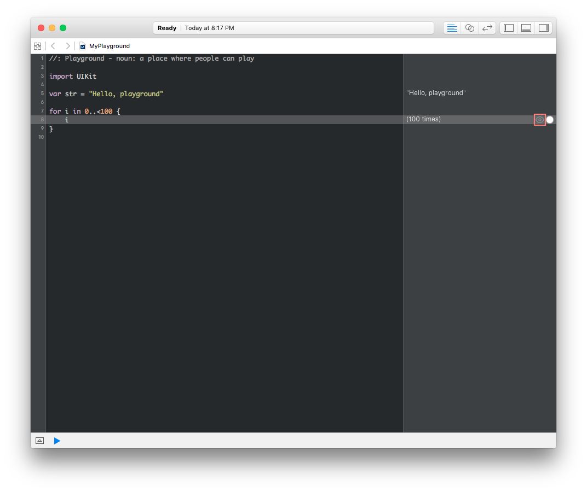
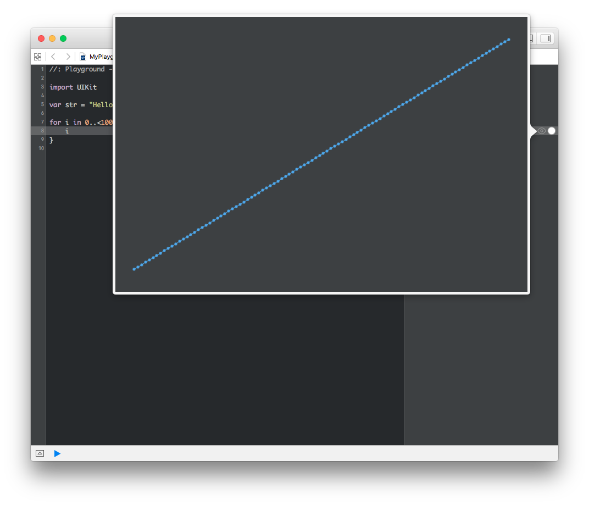
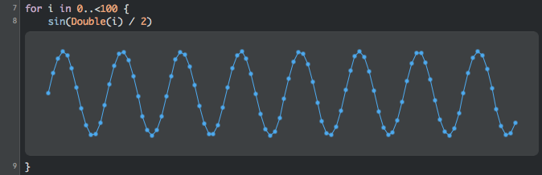

## Playground 사용해보기



Xcode 설치가 완료된 후 처음 실행하면 위와 같은 시작화면이 나옵니다. 설치를 완료했으니 이것저것 한 번 둘러봅시다. 먼저, 왼쪽에 있는 'Get started with a playground'를 한 번 눌러서 새로운 Playground를 만들어볼까요?



Playground 이름을 입력하고, Playground에서 사용할 플랫폼을 선택할 수 있습니다. 네이밍이 세상에서 제일 어려우니 그냥 기본값으로 선택하고 갑시다. Next를 누른 후 Playground를 생성할 디렉토리를 설정하고 나면 아래와 같은 Xcode 화면이 나옵니다. (저는 검정색 테마를 지정해놔서 검정색으로 보여요.)


Playground는 Xcode 6 업데이트에 새로 생긴 기능으로, Swift 코드를 작성하고 시각적으로 확인해볼 수 있는 곳입니다. 말그대로 Swift 코드를 위한 운동장이에요. 운동장에 왔으니까 밑도끝도 없이 아무거나 한 번 해볼까요?

```swift
for i in 0..<100 {
    i
}
```



이렇게 작성하고, 8번 라인의 오른쪽 끝에 있는 눈모양 아이콘을 누르면,



짠! 이렇게 실행 결과가 시각적으로 보여집니다. 바로 다음 시간부터 공부할 Swift 언어는 이 Playground를 사용해서 공부할 예정입니다. 까만 화면에 별모양 그리는 것보다는 훨씬 재밌게 공부할 수 있을 거예요.

조금만 더 손대면 이런 sin 함수에 대한 그래프도 만들 수 있습니다. 눈모양 버튼 바로 오른쪽의 (+) 버튼을 누르면 해당 라인 아래에 결과가 보여요.


