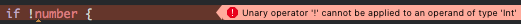

# 2강 - Swift 둘러보기

이제 본격적으로 Swift에 대해서 알아봅시다. 지난번처럼 Playground를 새로 만들고, 하나씩 따라서 입력해보면 금방 익힐 수 있을 거예요.

## Swift의 역사

직접 찾아보세요.

## 변수와 상수

변수<sup>variable</sup>는 값을 수정할 수 있고, 상수<sup>constant</sup>는 그렇지 않습니다. Swift에서는 언제 어디서 값이 어떻게 바뀔지 모르는 변수보다는 상수를 사용하는 것을 권장하고 있습니다. 그래야 안전하거든요.

변수는 `var`로 선언하고, 상수는 `let`으로 선언합니다.

```swift
var name = "Suyeol Jeon"
let birthyear = 1995
```

나중에 제가 만약 이름을 바꾸고 싶다면 바꿀 수 있어요.

```swift
name = "전수열"
```

하지만, 아래와 같이 태어난 해를 바꾸려 한다면 컴파일 에러가 발생합니다.

```swift
birthyear = 2000 // 컴파일 에러!
```


> Cannot assign to value: 'birthyear' is a 'let' constant

`let` 키워드로 선언된 상수의 값을 변경할 수 없다는 에러입니다. 이렇게, 바뀌면 안되는 값을 상수로 정의해두면 마음놓고 코딩할 수 있어요.

Swift는 정적 타이핑 언어입니다. 말이 어려운데요. 변수나 상수를 정의할 때 그 자료형(타입)이 어떤 것인지를 명시해주어야 하는 언어를 말해요. 예를 들면 이런 것이죠.

```swift
var name: String = "Suyeol Jeon"
let birthyear: Int = 1995
var height: Float = 180.1
```

`name`은 `String`이고, `birthyear`는 `Int`고, `height`은 `Float` 타입이네요. 이렇게 변수 또는 상수 이름 뒤에 콜론(`:`)을 붙이고 자료형을 써주면 된답니다. 이 때 사용하는 `: String`과 `: Int` 등을 가지고 타입 어노테이션<sup>Type Annotation</sup>이라고 합니다. 친구한테 가서 유식한 말 하나 배웠다고 자랑해도 돼요.

Swift에서는 타입을 굉장히 엄격하게 다루기 때문에, 다른 자료형끼리는 기본적인 연산조차 되지 않습니다. 아래와 같이 `Int` 타입인 `birthyear`와 `Float` 타입인 `height`을 더하려고 하면 컴파일 에러가 발생합니다.

```swift
birthyear + height // 컴파일 에러!
```


> Binary operator '+' cannot be applied to operands of type 'Int' and 'Float'

이건 좀 충격적이죠? 일반적인 다른 프로그래밍 언어라면 상상하기 어려운데요. 이럴 때에는 명확하게 다음과 같이 사용해야 합니다.

```swift
Float(birthyear) + height // 2175.1
```

저도 귀찮았는데, 조금만 참고 견디면 금방 익숙해질 거예요. 조금만 응용하면 아래와 같이 숫자를 문자열로 만들 수도 있게 됩니다.

```swift
String(birthyear) + "년에 태어난 " + name + "아 안녕!" // 1995년에 태어난 전수열아 안녕!
```

이렇게 쓰면 읽기가 어렵죠? Swift에서는 더 간단하게 작성할 수도 있습니다.

```swift
"\(birthyear)년에 태어난 \(name)아 안녕!" // 1995년에 태어난 전수열아 안녕!
```

### 타입 추론 (Type Inference)

오잉? 또잉? 그런데 우리가 처음에 사용한 예제에서는 자료형을 명시하지 않았어요. 그런데도 우리는 `name`이 문자열이라는 것을 알았고, `birthyear`가 정수형이라는 것을 알았어요.

Swift 컴파일러도 마찬가지로, 큰 따옴표(`"`)로 감싸진 텍스트는 `String` 타입인 것을 알고, 숫자는 `Int` 타입인 것을 인식할 수 있답니다. 꽤 똑똑하죠. 이렇게 타입을 직접 명시하지 않고도 값을 가지고 정적 타이핑을 할 수 있게 해주는 것을 *타입 추론<sup>Type Inference</sup>*이라고 합니다.

이것도 말이 좀 어렵죠. 그래도 알아두면 나중에 친구들 앞에서 "야, 자바는 타입 추론 되냐?" 하고 시비를 걸 수도 있으니 꼭 알아두시길 바랍니다.

### 배열(Array)과 딕셔너리(Dictionary)

배열과 딕셔너리는 모두 대괄호(`[]`)를 이용해서 정의할 수 있습니다. 이렇게요.

```swift
var languages = ["Swift", "Objective-C", "Python"]
var capitals = [
    "한국": "서울",
    "일본": "도쿄",
    "중국": "베이징",
]
```

배열과 딕셔너리에 접근하거나 값을 변경할 때에도 대괄호를 사용합니다. 쉽죠?

```swift
languages[0] // Swift
languages[1] = "Ruby"

capitals["한국"] // 서울
capitals["프랑스"] = "파리"
```

참고로, 다른 상수와 마찬가지로 배열과 딕셔너리를 `let`으로 정의하면 값을 수정할 수 없습니다. 물론 값을 추가하거나 빼는 것도 불가능합니다.

위에서 정의해본 `languages`와 `capitals`의 타입은 어떻게 쓸 수 있을까요? 이번에도 대괄호를 써요. 대신, 대괄호 안에 어떤 타입을 받을 것인지를 명시합니다.

```swift
var languages: [String] = ["Swift", "Objective-C", "Python"]
var capitals: [String: String] = [
    "한국": "서울",
    "일본": "도쿄",
    "중국": "베이징",
]
```

만약 빈 배열이나 빈 딕셔너리를 정의하고 싶다면? 이번에도 또 대괄호를 씁니다. 배열과 딕셔너리는 대괄호로 시작해서 대괄호로 끝나는 친구들이에요. (진짜 대괄호로 시작해서 대괄호로 끝나거든요.)

```swift
var languages: [String] = []
var capitals: [String: String] = [:]
```

빈 배열로 선언하는 것을 조금 더 간결하게 하고싶다면, 이렇게 할 수 있어요.

```swift
var languages = [String]()
var capitals = [String: String]()
```

타입 뒤에 괄호(`()`)를 쓰는 것은 *생성자<sup>Initializer</sup>*를 호출하는 것인데요. 아래에서 조금 더 자세하게 다룰 예정입니다.

## 조건문과 반복문

조건을 검사할 때에는 `if`, `switch`를 씁니다. 아래 코드는 `if`를 사용한 예시입니다.

```swift
var age = 19
var student = ""

if age >= 8 && age < 14 {
    student = "초등학생"
} else if age < 17 {
    student = "중학생"
} else if age < 20 {
    student = "고등학생"
} else {
    student = "기타"
}

student // 고등학생
```

`if`문의 조건절에는 값이 정확하게 참 혹은 거짓으로 나오는 `Bool` 타입을 사용해야 합니다. 위에서 언급한 것과 같이 Swift에서는 타입 검사를 굉장히 엄격하게 하기 때문에, 다른 언어에서 사용 가능한 아래와 같은 코드를 사용하지 못합니다.

```swift
var number = 0
if !number { // 컴파일 에러!
    // ...
}
```



> Unary operator '!' cannot be applied to an operand of type 'Int'

대신, 이렇게 써야해요.

```swift
if number == 0 {
    // ...
}
```

빈 문자열이나 배열 등을 검사할 때에도 명확하게 길이가 0인지를 검사해야 합니다.

```swift
if name.isEmpty { ... }
if languages.isEmpty { ... }
```

만약 C나 Java와 같은 프로그래밍 언어를 사용해봤다면 `switch`는 단순히 값이 '같은지'만을 검사하는 것으로 알고 있을텐데요. Swift의 `switch` 구문은 조금 특별합니다. 패턴 매칭이 가능하기 때문입니다. 아래 코드는 위에서 작성한 `if`문을 `switch`문으로 옮겨본 것입니다.

```swift
switch age {
case 8..<14:
    student = "초등학생"
case 14..<17:
    student = "중학생"
case 17..<20:
    student = "고등학생"
default:
    student = "기타"
}
```

`8..<14`와 같이 범위<sup>Range</sup> 안에 `age`가 포함되었는지 여부를 검사할 수 있습니다.

반복되는 연산을 할 때에는 `for`, `while`을 씁니다. `for` 구문을 사용해서 배열과 딕셔너리를 차례로 순환할 때에는 아래와 같이 씁니다.

```swift
for language in languages {
    print("저는 \(language) 언어를 다룰 수 있습니다.")
}

for (country, capital) in capitals {
    print("\(country)의 수도는 \(capital)입니다.")
}
```

쉽죠? 단순한 반복문을 만들고 싶다면 범위를 만들어서 반복시킬 수도 있어요. 아래 예시는 1강에서 Playground를 만들고 가장 먼저 입력했던 코드입니다.

```swift
for i in 0..<100 {
    i
}
```

만약 `i`를 사용하지 않는데 단순한 반복을 하고 싶다면, `i` 대신 `_`를 사용해서 무시할 수도 있어요.

```swift
for _ in 0..<10 {
    print("Hello!")
}
```

`-` 키워드는 어디서나 변수 이름 대신에 사용할 수 있는데요. 알아두면 유용하게 사용할 수 있답니다.

`while`은 조건문의 값이 `true`일 때 계속 반복됩니다.

```swift
var i = 0
while i < 100 {
    i += 1
}
```

## 옵셔널 (Optional)

Swift가 가지고 있는 가장 큰 특징 중 하나가 바로 옵셔널<sup>Optional</sup>입니다. 직역하면 '선택적인' 이라는 뜻이 되는데요. 값이 있을 수도 있고 없을 수도 있는 것을 나타냅니다.

예를 들어볼까요? 문자열의 값이 있으면 `"가나다"`가 될 것입니다. 그럼, 값이 없다면 `""`일까요? 땡. `""`도 엄연히 값이 있는 문자열입니다. 정확히는 '값이 없다'가 아니고 '빈 값'이죠. 값이 없는 문자열은 바로 `nil`입니다.

또 다른 예를 들어볼게요. 정수형의 값이 있으면 `123`과 같은 값이 있을 것입니다. 값이 없다면 `0`일까요? 마찬가지로 `0`은 `0`이라는 숫자 '값'입니다. 이 경우에도 값이 없는 정수는 `nil`입니다.

마찬가지로, 빈 배열이나 빈 딕셔너리라고 해서 '값이 없는'것이 아닙니다. 다만 '비어 있을' 뿐이죠. 배열과 딕셔너리의 경우에도 '없는 값'은 `nil`입니다.

이렇게, 값이 없는 경우를 나타낼 때에는 `nil`을 사용합니다. 그렇다고 해서 모든 변수에 `nil`을 넣을 수 있는 것은 아닙니다. 예로, 우리가 위에서 정의한 `name`이라는 변수에 `nil`을 넣으려 하면 에러가 발생합니다.

```swift
var name: String = "전수열"
name = nil // 컴파일 에러!
```


> Nil cannot be assigned to type 'String'

값이 있을 수도 있고 없을 수도 있는 변수를 정의할 때에는 타입 어노테이션에 `?`를 붙여야 합니다. 이렇게 정의한 변수를 바로 *옵셔널<sup>Optional</sup>*이라고 하고요. 옵셔널에 초깃값을 지정하지 않으면 기본값은 `nil`입니다.

```swift
var email: String?
print(email) // nil

email = "devxoul@gmail.com"
print(email) // Optional("devxoul@gmail.com")
```

옵셔널로 정의한 변수는 옵셔널이 아닌 변수와는 다릅니다. 예를 들어, 아래와 같은 코드는 사용할 수 없습니다.

```swift
let optionalEmail: String? = "devxoul@gmail.com"
let requiredEmail: String = optionalEmail // 컴파일 에러!
```


> Value of optional type 'String?' not unwrapped; did you mean to use '!' or '?'?

`requiredEmail` 변수는  옵셔널이 아닌 `String`이기 때문에 항상 값을 가지고 있어야 합니다. 반면에, `optionalEmail`은 옵셔널로 선언된 변수이기 때문에 실제 코드가 실행되기 전까지는 값이 있는지 없는지 알 수 없습니다. 따라서 Swift 컴파일러는 안전을 위해 `requiredEmail`에는 옵셔널로 선언된 변수를 대입할 수 없게 만들었습니다.

옵셔널은 개념적으로 이렇게 표현할 수 있습니다. 어떤 값 또는 `nil`을 가지고 있는 녀석이죠.

```
        ,-- 어떤 값 (String, Int, ...)
Optional
        `-- nil
```

### 옵셔널 바인딩 (Optional Binding)

그럼 옵셔널의 값을 가져오고 싶은 경우에는 어떻게 하면 될까요? 이 때 사용하는 것이 바로 *옵셔널 바인딩<sup>Optional Binding</sup>*입니다.

옵셔널 바인딩은 옵셔널의 값이 존재하는지를 검사한 뒤, 존재한다면 그 값을 다른 변수에 대입시켜줍니다. `if let` 또는 `if var`를 사용하는데요. 옵셔널의 값을 벗겨서 값이 있다면 `if`문 안으로 들어가고, 값이 `nil`이라면 그냥 통과하게 됩니다.

예를 들어, 아래의 코드에서 `optionalEmail`에 값이 존재한다면 `email`이라는 변수 안에 실제 값이 저장되고, `if`문 내에서 그 값을 사용할 수 있습니다. 만약 `optionalEmail`이 `nil`이라면 `if`문이 실행되지 않고 넘어갑니다.

```swift
if let email = optionalEmail {
    print(email) // optionalEmail의 값이 존재한다면 해당 값이 출력됩니다.
}
// optionalEmail의 값이 존재하지 않는다면 if문을 그냥 지나칩니다.
```

하나의 `if`문에서 콤마(`,`)로 구분하여 여러 옵셔널을 바인딩할 수 있습니다. 이곳에 사용된 모든 옵셔널의 값이 존재해야 `if`문 안으로 진입합니다.

```swift
var optionalName: String? = "전수열"
var optionalEmail: String? = "devxoul@gmail.com"

if let name = optionalName, email = optionalEmail {
    // name과 email 값이 존재
}
```

> **Tip**: 코드가 너무 길 경우에는, 이렇게 여러 줄에 걸쳐서 사용하는 것이 바람직합니다.
>
> ```swift
> if let name = optionalName,
>    let email = optionalEmail {
>     // name과 email 값이 존재
> }
> ```
> 
> 참고로, 두 번째 `let` 부터는 생략이 가능합니다.

위 코드는 아래 코드와 동일합니다.

```swift
if let name = optionalName {
    if let email = optionalEmail {
        // name과 email 값이 존재
    }
}
```

> **Tip**: 한 번의 `if`문에서 여러 옵셔널을 바인딩할 수 있게 된 것은 Swift 1.2 버전부터입니다. 이전 버전까지는 바로 위와 같이 여러 번으로 감싸진 옵셔널 바인딩을 사용했습니다.

옵셔널을 바인딩할 때 `where` 키워드를 통해 조건도 함께 지정할 수 있습니다. `where` 절은 옵셔널 바인딩이 일어난 후에 실행됩니다. 즉, 옵셔널이 벗겨진 값을 가지고 조건을 검사하게 됩니다.

```swift
var optionalAge: Int? = 22

if let age = optionalAge where age >= 20 {
    // age의 값이 존재하고, 20 이상입니다.
}
```

위 코드는 아래 코드와 동일합니다.

```swift
if let age = optionalAge {
    if age >= 20 {
        // age의 값이 존재하고, 20 이상입니다.
    }
}
```

## 옵셔널 체이닝 (Optional Chaining)

Swift 코드를 간결하게 만들어주는 많은 요소들이 있는데, *옵셔널 체이닝<sup>Optional Chaining</sup>*을 알게되면 다른 프로그래밍 언어가 조금 불편하게 느껴지는 경우가 생깁니다.

옵셔널 체이닝을 이해하는 데에는 설명보다 코드를 보는 편이 훨씬 좋습니다. 예컨대, 옵셔널로 선언된 어떤 배열을 떠올려봅시다. 이 배열이 '빈 배열'인지를 검사하려면 어떻게 해야 할까요? `nil`이 아니면서 빈 배열인지를 확인해보면 될 것입니다. 이렇게요.

```swift
let array: [String]? = []
var isEmptyArray = false

if let array = array where array.isEmpty {
    isEmptyArray = true
} else {
    isEmptyArray = false
}

isEmptyArray
```

옵셔널 체이닝을 사용하면 이 코드를 더 간결하게 쓸 수 있습니다.

```swift
let isEmptyArray = array?.isEmpty == true
```

혹시 감이 오시나요? 옵셔널 체이닝은 옵셔널의 속성에 접근할 때, 옵셔널 바인딩 과정을 `?` 키워드로 줄여주는 역할을 합니다. 다음과 같이 3가지 경우의 수를 생각해봅시다.

- `array`가 `nil`인 경우

    ```
    array?.isEmpty
    ~~~~~~
    여기까지 실행되고 `nil`을 반환합니다.
    ```

- `array`가 빈 배열인 경우

    ```
    array?.isEmpty
    ~~~~~~~~~~~~~~
    여기까지 실행되고 `true`를 반환합니다.
    ```

- `array`에 요소가 있는 경우

    ```
    array?.isEmpty
    ~~~~~~~~~~~~~~
    여기까지 실행되고 `false`를 반환합니다.
    ```

`array?.isEmpty`의 결과로 나올 수 있는 값은 `nil`, `true`, `false`가 됩니다. `isEmpty`의 반환값은 `Bool`인데, 옵셔널 체이닝으로 인해 `Bool?`을 반환하도록 바뀐 것이죠. 따라서 값이 실제로 `true`인지를 확인하려면, `== true`를 해주어야 합니다.

## 옵셔널 벗기기

옵셔널을 사용할 때마다 옵셔널 바인딩을 하는 것이 가장 바람직합니다. 하지만, 개발을 하다보면 분명히 값이 존재할 것임에도 불구하고 옵셔널로 사용해야 하는 경우가 종종 있는데요. 이럴 때에는 옵셔널에 값이 있다고 가정하고 값에 바로 접근할 수 있도록 도와주는 키워드인 `!`를 붙여서 사용하면 됩니다.

```swift
print(optionalEmail) // Optional("devxoul@gmail.com")
print(optionalEmail!) // devxoul@gmail.com
```

`!`를 사용할 때에는 주의할 점이 있는데, 옵셔널의 값이 `nil`인 경우에는 런타임 에러가 발생한다는 것입니다. Java의 NullPointerException과 비슷하다고 생각하시면 될 듯 합니다.

```swift
var optionalEmail: String?
print(optionalEmail!) // 런타임 에러!
```

> **fatal error: unexpectedly found nil while unwrapping an Optional value**

런타임 에러가 발생하면 iOS 앱은 강제로 종료(크래시)됩니다. 그러니 굉~~장히 조심해서 사용해야 해요.

## 암묵적으로 벗겨진 옵셔널 (Implicitly Unwrapped Optional)

만약, 옵셔널을 정의할 때 `?` 대신 `!`를 붙이면 `ImplicitlyUnwrappedOptional`이라는 옵셔널로 정의됩니다. 이름이 굉장히 길죠. 직역하면 '암묵적으로 벗겨진 옵셔널'입니다.

```swift
var email: String! = "devxoul@gmail.com"
print(email) // devxoul@gmail.com
```

이렇게 정의된 옵셔널은 `nil`을 포함할 수 있는 옵셔널이긴 한데, 접근할 때 옵셔널 바인딩이나 옵셔널을 벗기는 과정을 거치지 않고도 바로 값에 접근할 수 있다는 점에서 일반적인 옵셔널과 조금 다릅니다.

옵셔널 벗기기와 마찬가지로, 값이 없는데 접근을 시도하면 런타임 에러가 발생합니다.

```swift
var email: String!
print(email) // 런타임 에러!
```

> **fatal error: unexpectedly found nil while unwrapping an Optional value**

가급적이면 일반적인 옵셔널을 사용해서 정의하고, 옵셔널 바인딩 또는 옵셔널 체이닝을 통해 값에 접근하는 것이 더 바람직합니다.

## 함수와 클로저

함수는 `func` 키워드를 사용해서 정의합니다. `->` 를 사용해서 함수의 반환 타입을 지정합니다.

```swift
func hello(name: String, time: Int) -> String {
    var string = ""
    for _ in 0..<time {
        string += "\(name)님 안녕하세요!\n"
    }
    return string
}
```

Swift에서는 독특하게 함수를 호출할 때 파라미터 이름을 함께 써주어야 합니다. 첫 번째 파라미터는 예외적으로 파라미터 이름을 생략합니다.

```swift
hello("전수열", time: 3)
```

만약, 함수를 호출할 때 사용하는 파라미터 이름과 함수 내에서 사용하는 파라미터 이름을 다르게 사용하고 싶으면, 이렇게 할 수 있습니다.

```swift
func hello(name: String, numberOfTimes time: Int) {
    // 이곳에서는 `time`을 사용합니다.
}

hello("전수열", numberOfTimes: 3) // 이곳에서는 `numberOfTimes`를 사용합니다.
```

이 방법을 사용하면 첫 번째 파라미터에도 이름을 붙일 수 있습니다.

```swift
func hello(withName name: String, numberOfTimes time: Int) {
    // ...
}

hello(withName: "전수열", numberOfTimes: 3)
```

파라미터 이름을 `_`로 정의하면 함수를 호출할 때 파라미터 이름을 생략할 수 있게 됩니다.

```swift
func hello(name: String, _ time: Int) {
    // ...
}

hello("전수열", 3)
```

파라미터에 기본 값을 지정할 수도 있습니다. 기본 값이 지정된 파라미터는 함수 호출시 생략할 수 있습니다.

```swift
func hello(name: String, time: Int = 1) {
    // ...
}

hello("전수열")
```

`...`을 사용하면 개수가 정해지지 않은 파라미터를 받을 수 있습니다.

```swift
func sum(numbers: Int...) -> Int {
    var sum = 0
    for number in numbers {
        sum += number
    }
    return sum
}

sum(1, 2)
sum(3, 4, 5)
```

함수 안에 함수를 또 작성할 수도 있습니다.

```swift
func hello(name: String, time: Int) {
    func message(name: String) {
        return "\(name)님 안녕하세요!"
    }

    for _ in 0..<time {
        print message(name)
    }
}
```

심지어 함수 안에 정의한 함수를 반환할 수도 있습니다.

```swift
func helloGenerator(message: String) -> String -> String {
    func hello(name: String) -> String {
        return name + message
    }
    return hello
}

let hello = helloGenerator("님 안녕하세요!")
hello("전수열")
```

여기서 핵심은, `helloGenerator()` 함수의 반환 타입이 `String -> String`라는 것입니다. 즉, `helloGenerator()`는 '문자열을 받아서 문자열을 반환하는 함수'를 반환하는 함수인 것이죠.

만약 `helloGenerator()` 안에 정의한 `hello()` 함수가 여러개의 파라미터를 받는다면 이렇게 써야 합니다.

```swift
func helloGenerator(message: String) -> (String, String) -> String {
    func hello(firstName: String, lastName: String) -> String {
        return lastName + firstName + message
    }
    return hello
}

let hello = helloGenerator("님 안녕하세요!")
hello("수열", "전")
```

`String -> String`이 `(String, String) -> String`으로 바뀌었죠. 문자열 두 개를 받아서 문자열을 반환하는 의미입니다.

### 클로저 (Closure)

*클로저<sup>Closure</sup>*를 사용하면 바로 위에 작성한 코드를 조금 더 간결하게 만들 수 있습니다. 클로저는 중괄호(`{}`)로 감싸진 '실행 가능한 코드 블럭'입니다.

```swift
func helloGenerator(message: String) -> (String, String) -> String {
    return { (firstName: String, lastName: String) -> String in
        return lastName + firstName + message
    }
}
```

함수와는 다르게 함수 이름 정의가 따로 존재하지 않습니다. 하지만 파라미터를 받을 수 있고, 반환 값이 존재할 수 있다는 점에서 함수와 동일합니다. 혹시 눈치채셨나요? 함수는 이름이 있는 클로저입니다.

위 함수에서 클로저를 반환하는 코드를 조금 더 자세히 살펴볼까요? 클로저는 중괄호(`{}`)로 감싸져있습니다. 그리고 파라미터를 괄호로 감싸서 정의하고요. 함수와 마찬가지로 `->`를 사용해서 반환 타입을 명시합니다. 조금 다른 점은 `in` 키워드를 사용해서 파라미터, 반환 타입 영역과 실제 클로저의 코드를 분리하고 있습니다.

```swift
{ (firstName: String, lastName: String) -> String in
    return lastName + firstName + message
}
```

얼핏 봐서는 별로 간결하다는 느낌을 못받았죠? 클로저의 장점은 사실 간결함와 유연함에 있습니다. 바로 위에서 작성한 코드는 이해를 돕기 위해 생략가능한 것들을 하나도 생략하지 않고 모두 적었기 때문에 조금 복잡해보일 수 있습니다. 이제 하나씩 생략해볼까요?

Swift 컴파일러의 타입 추론 덕분에, `helloGenerator()` 함수에서 반환하는 타입을 가지고 클로저에서 어떤 파라미터를 받고 어떤 타입을 반환하는지를 알 수 있습니다. 과감하게 생략해버리죠.

```swift
func helloGenerator(message: String) -> (String, String) -> String {
    return { firstName, lastName in
        return lastName + firstName + message
    }
}
```

훨씬 깔끔해졌죠? 놀라운 사실은 여기서 생략할 수 있는게 더 있다는 사실입니다. 마찬가지로 타입 추론 덕분에 첫 번째 파라미터가 문자열이고, 두 번째 파라미터도 문자열이라는 것을 알 수 있습니다. 첫 번째 파라미터는 `$0`, 두 번째 파라미터는 `$1`로 바꿔서 쓸 수 있습니다.

```swift
func helloGenerator(message: String) -> (String, String) -> String {
    return {
        return $1 + $0 + message
    }
}
```

클로저 내부의 코드가 한 줄이라면, `return`까지도 생략해버릴 수 있답니다!

```swift
func helloGenerator(message: String) -> (String, String) -> String {
    return { $1 + $0 + message }
}
```

이제 진짜로 간결해졌죠? 처음에 작성했던 `helloGenerator()` 함수의 코드가 4줄이었는데 클로저를 사용하면서 3줄로 줄어들었고, 클로저에서 불필요한 부분을 생략하면서 달랑 1줄로 줄어들었습니다.

클로저는 변수처럼 정의할 수 있습니다.

```swift
let hello: (String, String) -> String = { $1 + $0 + "님 안녕하세요!" }
hello("수열", "전")
```

물론 옵셔널로도 정의할 수 있습니다. 옵셔널 체이닝도 가능하고요.

```swift
let hello: ((String, String) -> String)?
hello?("수열", "전")
```

클로저를 변수로 정의하고 함수에서 반환할 수도 있는 것처럼, 파라미터로도 받을 수 있습니다.

```swift
func manipulateNumber(number: Int, usingBlock block: Int -> Int) -> Int {
    return block(number)
}

manipulateNumber(10, usingBlock: { (number: Int) -> Int in
    return number * 2
})
```

아까 했던 것처럼, 생략할 수도 있습니다.

```swift
manipulateNumber(10, usingBlock: {
    $0 * 2
})
```

만약 함수의 마지막 파라미터가 클로저라면, 괄호와 파라미터 이름마저 생략해버릴 수 있습니다.

```swift
manipulateNumber(10) {
    $0 * 2
}
```

이런 구조로 만들어진 예시가 바로 `sort()`와 `filter()`입니다. 함수가 클로저 하나만을 파라미터로 받는다면, 괄호를 아예 쓰지 않아도 됩니다.

```swift
let numbers = [1, 3, 2, 6, 7, 5, 8, 4]

let sortedNumbers = numbers.sort { $0 < $1 }
print(sortedNumbers) // [1, 2, 3, 4, 5, 6, 7, 8]

let evens = numbers.filter { $0 % 2 == 0 }
print(evens) // [2, 6, 8, 4]
```

## 클래스와 구조체

*클래스<sup>Class</sup>*는 `class`로 정의하고, *구조체<sup>Structure</sup>*는 `struct`로 정의합니다.

```swift
class Dog {
    var name: String?
    var age: Int?

    func simpleDescription() -> String {
        return "🐶 \(self.name)"
    }
}

class Coffee {
    var name: String?
    var size: String?

    func simpleDescription() -> String {
        return "☕️ \(self.name)"
    }
}

var myDog = Dog()
myDog.name = "찡코"
myDog.age = 3
print(myDog.simpleDescription()) // 🐶 찡코

var myCoffee = Coffee()
myCoffee.name = "아메리카노"
myCoffee.size = "Venti"
print(myCoffee.simpleDescription()) // ☕️ 아메리카노
```

클래스는 상속이 가능합니다. 구조체는 불가능합니다.

```swift
class Animal {
    let numberOfLegs = 4
}

class Dog: Animal {
    var name: String?
    var age: Int?
}

var myDog = Dog()
print(myDog.numberOfLegs) // Animal 클래스로부터 상속받은 값 (4)
```

클래스는 참조<sup>Reference</sup>하고, 구조체는 복사<sup>Copy</sup>합니다.

```swift
var dog1 = Dog()  // dog1은 새로 만들어진 Dog()를 참조합니다.
var dog2 = dog1   // dog2는 dog1이 참조하는 Dog()를 똑같이 참조합니다.
dog1.name = "찡코" // dog1의 이름을 바꾸면 Dog()의 이름이 바뀌기 때문에,
print(dog2.name)  // dog2의 이름을 가져와도 바뀐 이름("찡코")이 출력됩니다.

var coffee1 = Coffee()   // coffee1은 새로 만들어진 Coffee() 그 자체입니다.
var coffee2 = coffee1    // coffee2는 coffee1을 복사한 값 자체입니다.
coffee1.name = "아메리카노" // coffee1의 이름을 바꿔도
coffee2.name             // coffee2는 완전히 별개이기 때문에 이름이 바뀌지 않습니다. (nil)
```

### 생성자 (Initializer)

클래스와 구조체 모두 생성자를 가지고 있습니다. 생성자에서는 속성의 초깃값을 지정할 수 있습니다.

```swift
class Dog {
    var name: String?
    var age: Int?
    
    init() {
        self.age = 0
    }
}

class Coffee {
    var name: String?
    var size: String?
    
    init() {
        self.size = "Tall"
    }
}
```

만약 속성이 옵셔널이 아니라면 항상 초깃값을 가져야 합니다. 만약 옵셔널이 아닌 속성이 초깃값을 가지고 있지 않으면 컴파일 에러가 발생합니다.

```swift
class Dog {
    var name: String?
    var age: Int // 컴파일 에러!
}
```

> **stored property 'age' without initial value prevents synthesized initializers**

속성을 정의할 때 초깃값을 지정해 주는 방법과,

```swift
class Dog {
    var name: String?
    var age: Int = 0 // 속성을 정의할 때 초깃값 지정
}
```

생성자에서 초깃값을 지정해주는 방법이 있습니다.

```swift
class Dog {
    var name: String?
    var age: Int
    
    init() {
        self.age = 0 // 생성자에서 초깃값 지정
    }
}
```

생성자도 함수와 마찬가지로 파라미터를 받을 수 있습니다.

```swift
class Dog {
    var name: String?
    var age: Int
    
    init(name: String?, age: Int) {
        self.name = name
        self.age = age
    }
}

var myDog = Dog(name: "찡코", age: 3)
```

만약 상속받은 클래스라면 생성자에서 상위 클래스의 생성자를 호출해주어야 합니다. 만약 생성자의 파라미터가 상위 클래스의 파라미터와 같다면, `override` 키워드를 붙여주어야 합니다. `super.init()`은 클래스 속성들의 초깃값이 모두 설정 된 후에 해야 합니다. 그리고 나서부터 자기 자신에 대한 `self` 키워드를 사용할 수 있습니다.

```swift
class Dog: Animal {
    var name: String?
    var age: Int
    
    override init() {
        self.age = 0 // 초깃값 설정
        super.init() // 상위 클래스 생성자 호출
        print(self.simpleDescription()) // 여기서부터 `self` 접근 가능
    }
    
    func simpleDescription() -> String {
        return "🐶 \(self.name)"
    }
}
```

만약, 위 예시 코드를 아래처럼 바꿔서 `super.init()`을 하기 전에 `self`에 접근한다면 컴파일 에러가 발생합니다.

```swift
override init() {
    self.age = 0
    print(self.simpleDescription()) // 컴파일 에러!
    super.init()
}
```

> **error: use of 'self' in method call 'simpleDescription' before super.init initializes self**

`deinit`은 메모리에서 해제된 직후에 호출됩니다.

```swift
class Dog {
    // ...
    
    deinit {
        print("메모리에서 해제됨")
    }
}
```

### 속성 (Properties)

속성은 크게 두 가지로 나뉩니다. *값을 가지는 속성<sup>Stored Property</sup>*과 *계산되는 속성<sup>Computed Property</sup>*인데요. 한글말로 쓰니까 굉장히 어색하네요. 쉽게 말하면 속성이 값 자체를 가지고 있는지, 혹은 어떠한 연산을 수행한 뒤 그 결과를 반환하는지의 차이입니다.

우리가 지금까지 정의하고 사용한 `name`, `age`와 같은 속성들은 모두 Stored Property입니다. Computed Property는 `get`, `set`을 사용해서 정의할 수 있습니다. `set`에서는 새로 설정될 값을 `newValue`라는 예약어를 통해 접근할 수 있습니다.

```swift
struct Hex {
    var decimal: Int?
    var hexString: String? {
        get {
            if let decimal = self.decimal {
                return String(decimal, radix: 16)
            } else {
                return nil
            }
        }
        set {
            if let newValue = newValue {
                self.decimal = Int(newValue, radix: 16)
            } else {
                self.decimal = nil
            }
        }
    }
}

var hex = Hex()
hex.decimal = 10
hex.hexString // "a"

hex.hexString = "b"
hex.decimal // 11
```

위 코드에서 `hexString`은 실제 값을 가지고 있지는 않지만, `decimal`로부터 값을 받아와 16진수 문자열로 만들어서 반환합니다. `decimal`은 Stored Property, `hexString`은 Computed Property입니다.

참고로, `get`만 정의할 경우에는 `get` 키워드를 생략할 수 있습니다. 이런 속성을 *읽기 전용<sup>Read Only</sup>*이라고 합니다.

```swift
class Hex {
    // ...

    var hexCode: String? {
        if let hex = self.hexString {
            return "0x" + hex
        }
        return nil
    }
}
```

`get`, `set`과 비슷한 `willSet`, `didSet`을 이용하면 속성에 값이 지정되기 직전과 직후에 원하는 코드를 실행할 수 있습니다.

```swift
struct Hex {
    var decimal: Int? {
        willSet {
            print("\(self.decimal)에서 \(newValue)로 값이 바뀔 예정입니다.")
        }
        didSet {
            print("\(oldValue)에서 \(self.decimal)로 값이 바뀌었습니다.")
        }
    }
}
```

마찬가지로, `willSet`에서는 새로운 값을 `newValue`로 얻어올 수 있고, `didSet`에서는 예전 값을 `oldValue`라는 예약어를 통해 얻어올 수 있습니다.

`willSet`과 `didSet`은 일반적으로 어떤 속성의 값이 바뀌었을 때 UI를 업데이트하거나 특정 메서드를 호출하는 등의 역할을 할 때에 사용됩니다.

## 튜플 (Tuple)

튜플<sup>Tuple</sup>은 어떠한 값들의 묶음입니다. 배열과 비슷하다고 볼 수 있는데요. 배열과는 다르게 길이가 고정되어있답니다. 값에 접근할 때에도 `[]` 대신 `.`을 사용해요.

```swift
var coffeeInfo = ("아메리카노", 5100)
coffeeInfo.0 // 아메리카노
coffeeInfo.1 // 5100
coffeeInfo.1 = 5100
```

이 튜플의 파라미터에 이름을 붙일 수도 있어요.

```swift
var namedCoffeeInfo = (coffee: "아메리카노", price: 5100)
namedCoffeeInfo.coffee // 아메리카노
namedCoffeeInfo.price // 5100
namedCoffeeInfo.price = 5100
```

이렇게 보면, 앞서 살펴본 구조체와 비슷하죠? 실제로도 간단한 자료형을 만들 때에는 구조체 대신 튜플을 사용해서 만들기도 한답니다.

튜플의 타입 어노테이션은 이렇게 생겼어요.

```swift
var coffeeInfo: (String, Int)
var namedCoffeeInfo: (coffee: String, price: Int)
```

튜플을 조금 응용하면, 아래와 같이 여러 변수에 값을 지정할 수도 있습니다.

```swift
let (coffee, price) = ("아메리카노", 5100)
coffee // 아메리카노
price // 5100
```

튜플이 가진 값을 가지고 변수에 값을 지정할 때, 무시하고 싶은 값이 있다면 `_` 키워드를 사용해서 할 수 있습니다. 아래 코드에서는 `"라떼"`라는 첫 번째 값을 무시합니다.

```swift
let (_, latteSize, lattePrice) = ("라떼", "Venti", 5600)
latteSize // Venti
lattePrice // 5600
```

물론, 튜플을 반환하는 함수도 만들 수 있습니다.

```swift
/// 커피 이름에 맞는 커피 가격 정보를 반환합니다. 일치하는 커피 이름이 없다면 `nil`을 반환합니다.
///
/// - Parameters:
///     - name: 커피 이름
///
/// - Returns: 커피 이름과 가격 정보로 구성된 튜플을 반환합니다.
func coffeeInfoForName(name: String) -> (name: String, price: Int)? {
    let coffeeInfoList: [(name: String, price: Int)] = [
        ("아메리카노", 5100),
        ("라떼", 5600),
    ]
    for coffeeInfo in coffeeInfoList {
        if coffeeInfo.name == name {
            return coffeeInfo
        }
    }
    return nil
}

coffeeInfoForName("아메리카노")?.price // 5100
coffeeInfoForName("에스프레소")?.price // nil

let (_, lattePrice) = coffeeInfoForName("라떼")!
lattePrice // 5600
```

## Enum

*열거*라는 뜻을 가진 *Enumeration*에서 따온 용어입니다. 한글로 번역할 때에는 *열거형*이라는 말을 많이 사용합니다. 1월부터 12월까지를 `enum`으로 한 번 정의해볼까요?

```swift
enum Month: Int {
    case January = 1
    case February
    case March
    case April
    case May
    case June
    case July
    case August
    case September
    case October
    case November
    case December

    func simpleDescription() -> String {
        switch self {
        case .January:
            return "1월"
        case .February:
            return "2월"
        case .March:
            return "3월"
        case .April:
            return "4월"
        case .May:
            return "5월"
        case .June:
            return "6월"
        case .July:
            return "7월"
        case .August:
            return "8월"
        case .September:
            return "9월"
        case .October:
            return "10월"
        case .November:
            return "11월"
        case .December:
            return "12월"
        }
    }
}

let december = Month.December
print(december.simpleDescription()) // 12월
print(december.rawValue)            // 12
```

위 예시에서 작성한 `Month`는 `Int`를 *원시값<sup>Raw Value</sup>*으로 가지도록 정의되었습니다. 그렇기 때문에 각 케이스들은 1부터 12까지의 값을 가지고 있습니다. `rawValue` 속성이 바로 그 값을 나타내는데요. 반대로, 원시값을 가지고 Enum을 만들 수도 있습니다.

```swift
let october = Month(rawValue: 10)
print(october) // Optional(Month.October)
```

`Month(rawValue:)`의 반환값이 옵셔널인 이유는, Enum에서 정의되지 않은 원시값을 가지고 생성할 경우 `nil`을 반환하기 때문입니다.

```swift
Month(rawValue: 13) // nil
```

일반적으로 Enum은 `Int`만을 원시값으로 가질 수 있다고 생각합니다. 다른 프로그래밍 언어에서는 모두 그렇거든요. 하지만, Swift의 Enum은 조금 독특합니다. (독특한게 좀 많죠?) 아래 예시는 `String`을 원시값으로 가지는 Enum입니다.

```swift
enum IssueState: String {
    case Open = "open"
    case Closed = "closed"
}
```

만약 어떤 API의 응답에서 내려주는 `state`의 값이 `open` 또는 `closed`라면, `if-else` 없이도 `IssueState(rawValue:)`를 사용해서 Enum을 생성할 수 있습니다.

Enum은 원시값을 가지지 않을 수도 있습니다. 원시값을 가져야 할 필요가 없다면 굳이 만들지 않아도 돼요.

```swift
enum Spoon {
    case Dirt
    case Bronze
    case Silver
    case Gold

    func simpleDescription() -> String {
        switch self {
        case .Dirt:
            return "흙수저"
        case .Bronze:
            return "동수저"
        case .Silver:
            return "은수저"
        case .Gold:
            return "금수저"
        }
    }
}
```

Enum을 예측할 수 있다면 Enum의 이름을 생략할 수 있습니다. 코드가 굉장히 간결해지겠죠?

```swift
let spoon: Spoon = .Gold // 변수에 타입 어노테이션이 있기 때문에 생략 가능

func doSomething(spoon: Spoon) {
    // ...
}
averageIncomeForSpoon(.Silver) // 함수 정의에 타입 어노테이션이 있기 때문에 생략 가능
```

### 인자를 가지는 Enum

Enum은 인자<sup>Argument</sup>을 가질 수 있습니다. 뚱딴지같은 소리같죠? 그런데 진짜로 인자를 가질 수 있습니다. 아래 예시는 어떤 API에 대한 에러를 정의한 것인데요. `InvalidParameter` 케이스는 필드 이름과 메시지를 가지도록 정의되었습니다.

```swift
enum Error {
    case InvalidParameter(String, String)
    case Timeout
}

let error = Error.InvalidParameter("email", "이메일 형식이 올바르지 않습니다.")
```

이 값을 꺼내올 수 있는 방법으로는 `if-case` 또는 `switch`를 활용하는 방법이 있습니다.

```swift
if case .InvalidParameter(let field, let message) = error {
    print(field) // email
    print(message) // 이메일 형식이 올바르지 않습니다.
}

switch error {
case .InvalidParameter(let field, let message):
    print(field) // email
    print(message) // 이메일 형식이 올바르지 않습니다.

default:
    break
}
```

> **응용하기**: `Error`에 `message`라는 읽기 전용 속성을 추가하고, 에러에 대한 명확한 메시지를 반환하도록 만들어봅시다. 더 나아가서, 있을법한 다른 에러에 대한 경우도 추가해봅시다.

### 충격적 사실!

사실, 옵셔널은 Enum입니다. 실제로 이렇게 생겼어요.

```swift
public enum Optional<Wrapped> {
    case None
    case Some(Wrapped)
}
```

옵셔널이 왜 '값'과 '없는 값'을 포함하고 있다고 설명했는지, 그리고 왜 '감싸다'라는 표현을 사용했는지 이해 가시나요?

옵셔널은 Enum이기 때문에, 아래와 같은 구문도 사용할 수 있습니다.

```swift
let age: Int? = 20

switch age {
case .None: // `nil`인 경우
    print("나이 정보가 없습니다.")

case .Some(let x) where x < 20:
    print("청소년")

case .Some(let x) where x < 65:
    print("성인")

default:
    print("어르신")
}
```

재밌죠? 😏

## 프로토콜

프로토콜은 인터페이스입니다. 최소한으로 가져야 할 속성이나 메서드를 정의합니다. 구현은 하지 않습니다. 진짜로 정의만 합니다.

```swift
/// 전송가능한 인터페이스를 정의합니다.
protocol Sendable {
    var from: String? { get }
    var to: String { get }

    func send()
}
```

클래스와 구조체에 프로토콜을 *적용<sup>Conform</sup>*시킬 수 있습니다. 프로토콜을 적용하면, 프로토콜에서 정의한 속성와 메서드를 모두 구현해야 합니다.

```swift
struct Mail: Sendable {
    var from: String?
    var to: String

    func send() {
        print("Send a mail from \(self.from) to \(self.to)")
    }
}

struct Feedback: Sendable {
    var from: String? {
        return nil // 피드백은 무조건 익명으로 보냅니다.
    }
    var to: String

    func send() {
        print("Send a feedback to \(self.to)")
    }
}
```

프로토콜은 마치 추상클래스처럼 사용될 수 있습니다.

```swift
func sendAnything(sendable: Sendable) {
    sendable.send()
}

let mail = Mail(from: "devxoul@gmail.com", to: "jeon@stylesha.re")
sendAnything(mail)

let feedback = Feedback(from: "devxoul@gmail.com")
sendAnything(feedback)
```

`sendAnything()` 함수는 `Sendable` 타입을 파라미터로 받습니다. `Mail`와 `Feedback`은 엄연히 다른 타입이지만, 모두 `Sendable`을 따르고 있으므로 `sendAnything()` 함수에 전달될 수 있습니다. 그리고, `Sendable`에서는 `send()` 함수를 정의하고 있기 때문에 호출이 가능합니다.

프로토콜은 또다른 프로토콜을 따를 수 있습니다.

```swift
protocol Messagable {
    var message: String? { get }
}

protocol Sendable: Messagable {
    // ...
}
```

`Sendable`은 `Messagable`을 기본적으로 따르는 프로토콜입니다. 따라서, `Sendable`을 적용하려면 `var message: String? { get }`을 정의해주어야 합니다.

> **응용하기**: `Sendable`에 `Messagable`을 적용하고, `Mail`과 `Feedback`에 발생하는 컴파일 에러를 고쳐보세요.

### Any와 AnyObject

`Any`는 모든 타입에 대응합니다. `AnyObject`는 모든 객체<sup>Object</sup>에 대응합니다.

```swift
let anyNumber: Any = 10
let anyString: Any = "Hi"

let anyInstance: AnyObject = Dog()
```

`Any`와 `AnyObject`는 프로토콜입니다. Swift에서 사용 가능한 모든 타입은 `Any`를 따르도록 설계되었고, 모든 클래스들에는 `AnyObject` 프로토콜이 적용되어있습니다.

### 타입 캐스팅 (Type Casting)

`anyNumber`에 `10`을 넣었다고 해서 `anyNumber`가 `Int`는 아닙니다. '`Any` 프로토콜을 따르는 어떤 값'이기 때문이죠.

```swift
anyNumber + 1 // 컴파일 에러!
```

이럴 때에는 `as`를 이용해서 *다운 캐스팅<sup>Down Casting</sup>*을 해야 합니다. `Any`는 `Int`보다 더 큰 범위이기 때문에, 작은 범위로 줄인다고 하여 '다운 캐스팅'입니다.

`Any`는 `Int` 뿐만 아니라 `String`과 같은 전혀 엉뚱한 타입도 포함되어 있기 때문에 무조건 `Int`로 변환되지 않습니다. 따라서 `as?`를 사용해서 옵셔널을 취해야 합니다.

```swift
let number: Int? = anyNumber as? Int
```

옵셔널이기 때문에, 옵셔널 바인딩 문법도 사용할 수 있습니다. 실제로 이렇게 사용하는 경우가 굉장히 많습니다.

```swift
if let number = anyNumber as? Int {
    print(number + 1)
}
```

### 타입 검사

타입 캐스팅까지는 필요 없고, 만약 어떤 값이 특정한 타입인지를 검사할 때에는 `is`를 사용할 수 있습니다.

```swift
print(anyNumber is Int)    // true
print(anyNumber is Any)    // true
print(anyNumber is String) // false
print(anyString is String) // true
```

### 변환가능함 (Convertible)

우리는 지금까지 `10`은 `Int`, `"Hi"`는 `String`이라고 '당연하게' 인지하고 있었습니다. 하지만, 엄밀히 하자면 `10`은 원래 `Int(10)`으로 선언되어야 하고, `"Hi"`는 `String("Hi")`로 선언되어야 합니다. `Int`와 `String` 모두 생성자를 가지는 구조체이기 때문이죠.

이렇게, 생성자를 사용하지 않고도 생성할 수 있게 만드는 것을 *리터럴<sup>Literal</sup>*이라고 합니다. 직역하면 '문자 그대로'라는 뜻이에요. 아래 코드는 문자 그대로 `10`, 문자 그대로 `"Hi"`, 문자 그대로 배열이고 딕셔너리입니다.

```swift
let number = 10
let string = "Hi"
let array = ["a", "b", "c"]
let dictionary = [
    "key1": "value1",
    "key2": "value2",
]
```

이 리터럴을 가능하게 해주는 프로토콜이 있답니다. 바로 `XxxLiteralConvertible` 인데요. `Int`는 `IntegerLiteralConvertible`을, `String`은 `StringLiteralConvertible`을, `Array`는 `ArrayLiteralConvertible`을, `Dictionary`는 `DictionaryLiteralConvertible` 프로토콜을 따르고 있습니다. 각 프로토콜은 리터럴 값을 받는 생성자를 정의하고 있어요. 놀랍죠?

우리도 만들 수 있어요.

```swift
struct DollarConverter: IntegerLiteralConvertible {
    typealias IntegerLiteralType = Int

    let price = 1_177
    var dollars: Int

    init(integerLiteral value: IntegerLiteralType) {
        self.dollars = value * self.price
    }
}

let converter: DollarConverter = 100
converter.dollars // 117700
```

> **Tip**: `typealias`는 C의 `typedef`와 같습니다. `typedef MyInt = Int`라고 하면, 새로 생성된 `MyInt`는 `Int`와 완전히 동일한 타입입니다. 프로토콜에서도 `typealias`를 정의할 수 있습니다.

> **Tip**: `1177`은 가독성을 위해 `1_177`로 쓸 수 있습니다. `12_345`는 `12345`랑 같아요. `1234_5`도 `12345`와 같습니다.

분명히 구조체를 만들었는데, `IntegerLiteralConvertible`을 적용하니까 `= 100`과 같은 문법을 사용할 수 있게 되었습니다.

> **응용하기**: `ArrayLiteralConvertible`을 적용하여 아래와 같이 홀수와 짝수를 나눠서 보관하는 `NumberFilter` 구조체를 만들어보세요.
>
> ```swift
> let oddEvenFilter: OddEvenFilter = [1, 3, 5, 2, 7, 4]
> oddEvenFilter.odds  // [1, 3, 5, 7]
> oddEvenFilter.evens // [2, 4]
> ```

## 익스텐션 (Extension)
