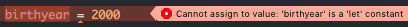
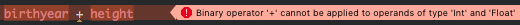

# 2강 - Swift 둘러보기

이제 본격적으로 Swift에 대해서 알아봅시다. 지난번처럼 Playground를 새로 만들고, 하나씩 따라서 입력해보면 금방 익힐 수 있을 거예요.

## 변수와 상수

변수<sup>variable</sup>는 값을 수정할 수 있고, 상수<sup>constant</sup>는 그렇지 않습니다. Swift에서는 언제 어디서 값이 어떻게 바뀔지 모르는 변수보다는 상수를 사용하는 것을 권장하고 있습니다. 그래야 안전하거든요.

변수는 `var`로 선언하고, 상수는 `let`으로 선언합니다.

```swift
var name = "Suyeol Jeon"
let birthyear = 1995
```

나중에 제가 만약 이름을 바꾸고 싶다면 바꿀 수 있어요.

```swift
name = "전수열"
```

하지만, 아래와 같이 태어난 해를 바꾸려 한다면 컴파일 에러가 발생합니다.

```swift
birthyear = 2000
```



> Cannot assign to value: 'birthyear' is a 'let' constant

`let` 키워드로 선언된 상수의 값을 변경할 수 없다는 에러입니다. 이렇게, 바뀌면 안되는 값을 상수로 정의해두면 마음놓고 코딩할 수 있어요.

Swift는 정적 타이핑 언어입니다. 말이 어려운데요. 변수나 상수를 정의할 때 그 자료형(타입)이 어떤 것인지를 명시해주어야 하는 언어를 말해요. 예를 들면 이런 것이죠.

```swift
var name: String = "Suyeol Jeon"
let birthyear: Int = 1995
var height: Float = 180.1
```

`name`은 `String`이고, `birthyear`는 `Int`고, `height`은 `Float` 타입이네요. 이렇게 변수 또는 상수 이름 뒤에 콜론(`:`)을 붙이고 자료형을 써주면 된답니다. 이 때 사용하는 `: String`과 `: Int` 등을 가지고 타입 어노테이션<sup>Type Annotation</sup>이라고 합니다. 친구한테 가서 유식한 말 하나 배웠다고 자랑해도 돼요.

### 타입 추론 (Type Inference)

오잉? 또잉? 그런데 우리가 처음에 사용한 예제에서는 자료형을 명시하지 않았어요. 그런데도 우리는 `name`이 문자열이라는 것을 알았고, `birthyear`가 정수형이라는 것을 알았어요.

Swift 컴파일러도 마찬가지로, 큰 따옴표(`"`)로 감싸진 텍스트는 `String` 타입인 것을 알고, 숫자는 `Int` 타입인 것을 인식할 수 있답니다. 꽤 똑똑하죠. 이렇게 타입을 직접 명시하지 않고도 값을 가지고 정적 타이핑을 할 수 있게 해주는 것을 *타입 추론<sup>Type Inference</sup>*이라고 합니다.

이것도 말이 좀 어렵죠. 그래도 알아두면 나중에 친구들 앞에서 "야, 자바는 타입 추론 되냐?" 하고 시비를 걸 수도 있으니 꼭 알아두시길 바랍니다.

### 타입 캐스팅 (Type Casting)

타입 캐스팅은 특정한 타입으로 선언된 변수 혹은 상수의 값을 다른 타입으로 변환하는 것을 말합니다. 예컨대, 위에서 선언한 `name`과 `birthyear`를 가지고 "1995년에 태어난 전수열아 안녕!" 이라는 문자열을 만들고 싶으면 아래와 같이 할 수 있습니다.

```swift
String(birthyear) + "년에 태어난 " + name + "아 안녕!" // 1995년에 태어난 전수열아 안녕!
```

이렇게 쓰면 읽기가 어렵죠? Swift에서는 더 간단하게 작성할 수도 있습니다.

```swift
"\(birthyear)년에 태어난 \(name)아 안녕!" // 1995년에 태어난 전수열아 안녕!
```

Swift에서는 타입을 굉장히 엄격하게 다루기 때문에, 다른 자료형끼리는 기본적인 연산조차 되지 않습니다. 아래와 같이 `Int` 타입인 `birthyear`와 `Float` 타입인 `height`을 더하려고 하면 컴파일 에러가 발생합니다.

```swift
birthyear + height
```



> Binary operator '+' cannot be applied to operands of type 'Int' and 'Float'

이건 좀 충격적이죠? 일반적인 다른 프로그래밍 언어라면 상상하기 어려운데요. 이럴 때에는 명확하게 다음과 같이 사용해야 합니다.

```swift
Float(birthyear) + height // 2175.1
```

저도 귀찮았는데, 조금만 참고 견디면 금방 익숙해질 거예요.

### 배열(Array)과 딕셔너리(Dictionary)

배열과 딕셔너리는 모두 대괄호(`[]`)를 이용해서 정의할 수 있습니다. 이렇게요.

```swift
var languages = ["Swift", "Objective-C", "Python"]
var capitals = [
    "한국": "서울",
    "일본": "도쿄",
    "중국": "베이징",
]
```

배열과 딕셔너리에 접근하거나 값을 변경할 때에도 대괄호를 사용합니다. 쉽죠?

```swift
languages[0] // Swift
languages[1] = "Ruby"

capitals["한국"] // 서울
capitals["프랑스"] = "파리"
```

참고로, 다른 상수와 마찬가지로 배열과 딕셔너리를 `let`으로 정의하면 값을 수정할 수 없습니다. 물론 값을 추가하거나 빼는 것도 불가능합니다.

위에서 정의해본 `languages`와 `capitals`의 타입은 어떻게 쓸 수 있을까요? 이번에도 대괄호를 써요. 대신, 대괄호 안에 어떤 타입을 받을 것인지를 명시합니다.

```swift
var languages: [String] = ["Swift", "Objective-C", "Python"]
var capitals: [String: String] = [
    "한국": "서울",
    "일본": "도쿄",
    "중국": "베이징",
]
```

만약 빈 배열이나 빈 딕셔너리를 정의하고 싶다면? 이번에도 또 대괄호를 씁니다. 배열과 딕셔너리는 대괄호로 시작해서 대괄호로 끝나는 친구들이에요. (진짜 대괄호로 시작해서 대괄호로 끝나거든요.)

```swift
var languages: [String] = []
var capitals: [String: String] = [:]
```

빈 배열로 선언하는 것을 조금 더 간결하게 하고싶다면, 이렇게 할 수 있어요.

```swift
var languages = [String]()
var capitals = [String: String]()
```

타입 뒤에 괄호(`()`)를 쓰는 것은 *생성자<sup>Initializer</sup>*를 호출하는 것인데요. 아래에서 조금 더 자세하게 다룰 예정입니다.
