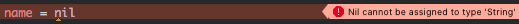
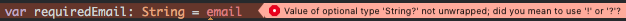

## 옵셔널 (Optional)

Swift가 가지고 있는 가장 큰 특징 중 하나가 바로 옵셔널<sup>Optional</sup>입니다. 직역하면 '선택적인' 이라는 뜻이 되는데요. 값이 있을 수도 있고 없을 수도 있는 것을 나타냅니다.

예를 들어볼까요? 문자열의 값이 있으면 `"가나다"`가 될 것입니다. 그럼, 값이 없다면 `""`일까요? 땡. `""`도 엄연히 값이 있는 문자열입니다. 정확히는 '값이 없다'가 아니고 '빈 값'이죠. 값이 없는 문자열은 바로 `nil`입니다.

또 다른 예를 들어볼게요. 정수형의 값이 있으면 `123`과 같은 값이 있을 것입니다. 값이 없다면 `0`일까요? 마찬가지로 `0`은 `0`이라는 숫자 '값'입니다. 이 경우에도 값이 없는 정수는 `nil`입니다.

마찬가지로, 빈 배열이나 빈 딕셔너리라고 해서 '값이 없는'것이 아닙니다. 다만 '비어 있을' 뿐이죠. 배열과 딕셔너리의 경우에도 '없는 값'은 `nil`입니다.

이렇게, 값이 없는 경우를 나타낼 때에는 `nil`을 사용합니다. 그렇다고 해서 모든 변수에 `nil`을 넣을 수 있는 것은 아닙니다. 예로, 우리가 위에서 정의한 `name`이라는 변수에 `nil`을 넣으려 하면 에러가 발생합니다.

```swift
var name: String = "전수열"
name = nil // 컴파일 에러!
```



> Nil cannot be assigned to type 'String'

값이 있을 수도 있고 없을 수도 있는 변수를 정의할 때에는 타입 어노테이션에 `?`를 붙여야 합니다. 이렇게 정의한 변수를 바로 *옵셔널<sup>Optional</sup>*이라고 하고요. 옵셔널에 초깃값을 지정하지 않으면 기본값은 `nil`입니다.

```swift
var email: String?
print(email) // nil

email = "devxoul@gmail.com"
print(email) // Optional("devxoul@gmail.com")
```

옵셔널로 정의한 변수는 옵셔널이 아닌 변수와는 다릅니다. 예를 들어, 아래와 같은 코드는 사용할 수 없습니다.

```swift
let optionalEmail: String? = "devxoul@gmail.com"
let requiredEmail: String = optionalEmail // 컴파일 에러!
```



> Value of optional type 'String?' not unwrapped; did you mean to use '!' or '?'?

`requiredEmail` 변수는  옵셔널이 아닌 `String`이기 때문에 항상 값을 가지고 있어야 합니다. 반면에, `optionalEmail`은 옵셔널로 선언된 변수이기 때문에 실제 코드가 실행되기 전까지는 값이 있는지 없는지 알 수 없습니다. 따라서 Swift 컴파일러는 안전을 위해 `requiredEmail`에는 옵셔널로 선언된 변수를 대입할 수 없게 만들었습니다.

옵셔널은 개념적으로 이렇게 표현할 수 있습니다. 어떤 값 또는 `nil`을 가지고 있는 녀석이죠.

```
        ,-- 어떤 값 (String, Int, ...)
Optional
        `-- nil
```

### 옵셔널 바인딩 (Optional Binding)

그럼 옵셔널의 값을 가져오고 싶은 경우에는 어떻게 하면 될까요? 이 때 사용하는 것이 바로 *옵셔널 바인딩<sup>Optional Binding</sup>*입니다.

옵셔널 바인딩은 옵셔널의 값이 존재하는지를 검사한 뒤, 존재한다면 그 값을 다른 변수에 대입시켜줍니다. `if let` 또는 `if var`를 사용하는데요. 옵셔널의 값을 벗겨서 값이 있다면 `if`문 안으로 들어가고, 값이 `nil`이라면 그냥 통과하게 됩니다.

예를 들어, 아래의 코드에서 `optionalEmail`에 값이 존재한다면 `email`이라는 변수 안에 실제 값이 저장되고, `if`문 내에서 그 값을 사용할 수 있습니다. 만약 `optionalEmail`이 `nil`이라면 `if`문이 실행되지 않고 넘어갑니다.

```swift
if let email = optionalEmail {
    print(email) // optionalEmail의 값이 존재한다면 해당 값이 출력됩니다.
}
// optionalEmail의 값이 존재하지 않는다면 if문을 그냥 지나칩니다.
```

하나의 `if`문에서 콤마(`,`)로 구분하여 여러 옵셔널을 바인딩할 수 있습니다. 이곳에 사용된 모든 옵셔널의 값이 존재해야 `if`문 안으로 진입합니다.

```swift
var optionalName: String? = "전수열"
var optionalEmail: String? = "devxoul@gmail.com"

if let name = optionalName, email = optionalEmail {
    // name과 email 값이 존재
}
```

> **Tip**: 코드가 너무 길 경우에는, 이렇게 여러 줄에 걸쳐서 사용하는 것이 바람직합니다.
>
> ```swift
> if let name = optionalName,
>    let email = optionalEmail {
>     // name과 email 값이 존재
> }
> ```
> 
> 참고로, 두 번째 `let` 부터는 생략이 가능합니다.

위 코드는 아래 코드와 동일합니다.

```swift
if let name = optionalName {
    if let email = optionalEmail {
        // name과 email 값이 존재
    }
}
```

> **Tip**: 한 번의 `if`문에서 여러 옵셔널을 바인딩할 수 있게 된 것은 Swift 1.2 버전부터입니다. 이전 버전까지는 바로 위와 같이 여러 번으로 감싸진 옵셔널 바인딩을 사용했습니다.

옵셔널을 바인딩할 때 `where` 키워드를 통해 조건도 함께 지정할 수 있습니다. `where` 절은 옵셔널 바인딩이 일어난 후에 실행됩니다. 즉, 옵셔널이 벗겨진 값을 가지고 조건을 검사하게 됩니다.

```swift
var optionalAge: Int? = 22

if let age = optionalAge where age >= 20 {
    // age의 값이 존재하고, 20 이상입니다.
}
```

위 코드는 아래 코드와 동일합니다.

```swift
if let age = optionalAge {
    if age >= 20 {
        // age의 값이 존재하고, 20 이상입니다.
    }
}
```

### 옵셔널 체이닝 (Optional Chaining)

Swift 코드를 간결하게 만들어주는 많은 요소들이 있는데, *옵셔널 체이닝<sup>Optional Chaining</sup>*을 알게되면 다른 프로그래밍 언어가 조금 불편하게 느껴지는 경우가 생깁니다.

옵셔널 체이닝을 이해하는 데에는 설명보다 코드를 보는 편이 훨씬 좋습니다. 예컨대, 옵셔널로 선언된 어떤 배열을 떠올려봅시다. 이 배열이 '빈 배열'인지를 검사하려면 어떻게 해야 할까요? `nil`이 아니면서 빈 배열인지를 확인해보면 될 것입니다. 이렇게요.

```swift
let array: [String]? = []
var isEmptyArray = false

if let array = array where array.isEmpty {
    isEmptyArray = true
} else {
    isEmptyArray = false
}

isEmptyArray
```

옵셔널 체이닝을 사용하면 이 코드를 더 간결하게 쓸 수 있습니다.

```swift
let isEmptyArray = array?.isEmpty == true
```

혹시 감이 오시나요? 옵셔널 체이닝은 옵셔널의 속성에 접근할 때, 옵셔널 바인딩 과정을 `?` 키워드로 줄여주는 역할을 합니다. 다음과 같이 3가지 경우의 수를 생각해봅시다.

- `array`가 `nil`인 경우

    ```
    array?.isEmpty
    ~~~~~~
    여기까지 실행되고 `nil`을 반환합니다.
    ```

- `array`가 빈 배열인 경우

    ```
    array?.isEmpty
    ~~~~~~~~~~~~~~
    여기까지 실행되고 `true`를 반환합니다.
    ```

- `array`에 요소가 있는 경우

    ```
    array?.isEmpty
    ~~~~~~~~~~~~~~
    여기까지 실행되고 `false`를 반환합니다.
    ```

`array?.isEmpty`의 결과로 나올 수 있는 값은 `nil`, `true`, `false`가 됩니다. `isEmpty`의 반환값은 `Bool`인데, 옵셔널 체이닝으로 인해 `Bool?`을 반환하도록 바뀐 것이죠. 따라서 값이 실제로 `true`인지를 확인하려면, `== true`를 해주어야 합니다.

### 옵셔널 벗기기

옵셔널을 사용할 때마다 옵셔널 바인딩을 하는 것이 가장 바람직합니다. 하지만, 개발을 하다보면 분명히 값이 존재할 것임에도 불구하고 옵셔널로 사용해야 하는 경우가 종종 있는데요. 이럴 때에는 옵셔널에 값이 있다고 가정하고 값에 바로 접근할 수 있도록 도와주는 키워드인 `!`를 붙여서 사용하면 됩니다.

```swift
print(optionalEmail) // Optional("devxoul@gmail.com")
print(optionalEmail!) // devxoul@gmail.com
```

`!`를 사용할 때에는 주의할 점이 있는데, 옵셔널의 값이 `nil`인 경우에는 런타임 에러가 발생한다는 것입니다. Java의 NullPointerException과 비슷하다고 생각하시면 될 듯 합니다.

```swift
var optionalEmail: String?
print(optionalEmail!) // 런타임 에러!
```

> **fatal error: unexpectedly found nil while unwrapping an Optional value**

런타임 에러가 발생하면 iOS 앱은 강제로 종료(크래시)됩니다. 그러니 굉~~장히 조심해서 사용해야 해요.

### 암묵적으로 벗겨진 옵셔널 (Implicitly Unwrapped Optional)

만약, 옵셔널을 정의할 때 `?` 대신 `!`를 붙이면 `ImplicitlyUnwrappedOptional`이라는 옵셔널로 정의됩니다. 이름이 굉장히 길죠. 직역하면 '암묵적으로 벗겨진 옵셔널'입니다.

```swift
var email: String! = "devxoul@gmail.com"
print(email) // devxoul@gmail.com
```

이렇게 정의된 옵셔널은 `nil`을 포함할 수 있는 옵셔널이긴 한데, 접근할 때 옵셔널 바인딩이나 옵셔널을 벗기는 과정을 거치지 않고도 바로 값에 접근할 수 있다는 점에서 일반적인 옵셔널과 조금 다릅니다.

옵셔널 벗기기와 마찬가지로, 값이 없는데 접근을 시도하면 런타임 에러가 발생합니다.

```swift
var email: String!
print(email) // 런타임 에러!
```

> **fatal error: unexpectedly found nil while unwrapping an Optional value**

가급적이면 일반적인 옵셔널을 사용해서 정의하고, 옵셔널 바인딩 또는 옵셔널 체이닝을 통해 값에 접근하는 것이 더 바람직합니다.
