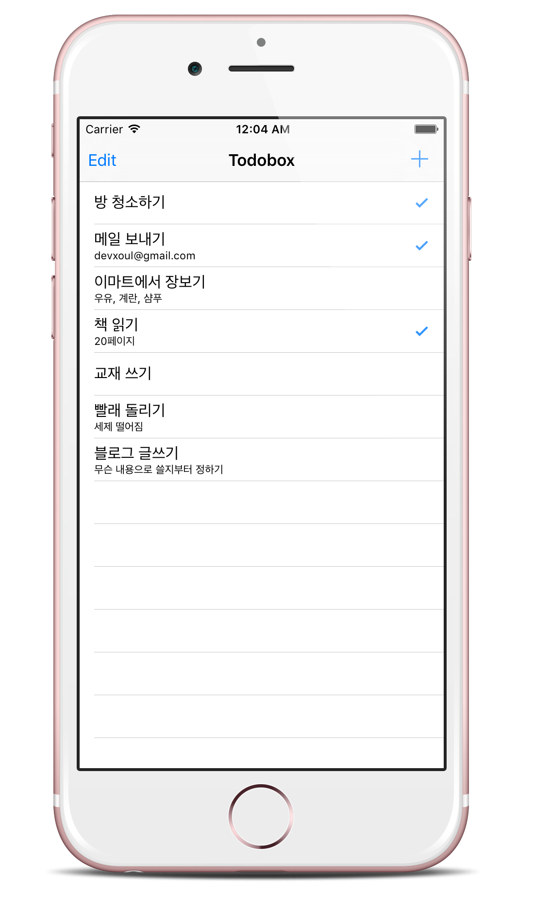
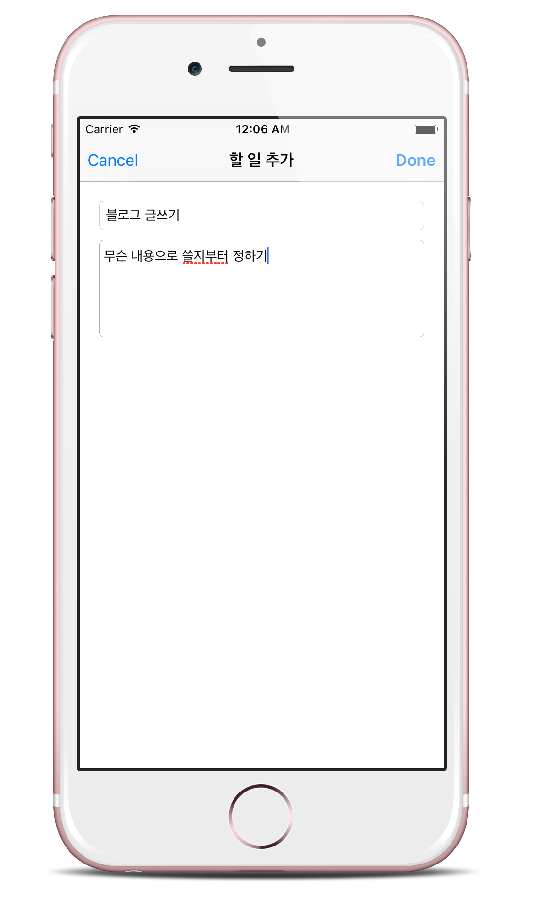

# 4강 - 할 일 목록 관리 앱 Todobox 만들기 (1)

지금까지 Swift 문법에 대해 알아보았습니다. 빨리 실제로 써보고 싶어서 몸이 근질근질하죠? 이제는 진짜로 앱을 만들어봅시다.

처음으로 만들어볼 애플리케이션은 할 일 목록을 관리해주는 'Todobox'입니다.

Todobox를 만들면서 배우게 될 내용은 다음과 같습니다.

- 스토리보드에서 만든 컴포넌트를 Swift 코드와 연결하기 (@IBOutlet, @IBAction)
- 테이블 뷰에 데이터를 보여주고, 추가/삭제/변경하기 (UITableView)
- 네비게이션 컨트롤러 (UINavigationController)
- 바 버튼 아이템 (UIBarButtonItem)
- 기기에 데이터 저장하고 꺼내오기 (NSUserDefaults)
- 텍스트 필드 (UITextField)
- 텍스트 뷰 (UITextView)

완성된 Todobox 앱의 소스코드와 커밋로그는 [GitHub](https://github.com/devxoul/Todobox)에서 볼 수 있습니다.
