## 테이블 뷰 다루기

*테이블 뷰<sup>Table View</sup>*는 데이터를 목록 형태로 보여줄 수 있는 가장 기본적인 컴포넌트 단위입니다. 연락처, 음악 등 대부분의 앱에서 테이블 뷰를 활용하고 있습니다. 다른 플랫폼에서는 '리스트 뷰'와 같은 이름을 사용하곤 하는데, iOS에서는 '테이블 뷰'라는 이름을 사용합니다. 그렇다고 해서 열<sup>column</sup>을 가지고 있지는 않습니다. 조금 낯설죠?

### 스토리보드 (Storyboard)

어쨌거나, 애플에서 테이블 뷰라고 했으니 테이블 뷰라고 합시다. 우리는 *인터페이스 빌더<sup>Interface Builder</sup>*에서 테이블 뷰를 추가할 것인데요. 인터페이스 빌더는 드래그 앤 드랍으로 사용자 인터페이스를 구성할 수 있게 해주는 직관적인 도구입니다. 화면의 흐름과, 화면에 들어가는 컴포넌트를 손쉽게 구성할 수 있습니다.

iOS 프로젝트에서는 기본적으로 **`Main.storyboard`**라는 기본 스토리보드 파일을 제공합니다. 바로 아래에는 **`LaunchScreen.storyboard`**라는 스토리보드가 하나 더 있는데요. **`Main.storyboard`**는 앱에서의 전체 화면을 담고 있고, **`LaunchScreen.storyboard`**는 앱이 실행되기 전에 보이는 스플래시<sup>Splash</sup> 화면을 담고 있습니다. **`LaunchScreen.storyboard`**을 다루는 것은 따로 다루지 않을 예정입니다.

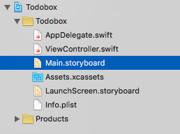

이제 **`Main.storyboard`** 파일을 선택해서 열어봅시다. 'View Controller'라고 적힌 큰 사각형이 하나 보이고, 그 사각형을 가리키는 화살표가 하나 있네요. *뷰 컨트롤러<sup>View Controller</sup>*는 iOS 앱에서 사용되는 화면 단위라고 이해하면 쉽습니다. 꼭 그렇지만은 않을 수도 있는데요. 일단은 그렇게 이해하는게 편하니 넘어갑시다. 그리고 화살표는 앱이 실행되면 처음 보여지는 화면이라는 것을 나타냅니다.

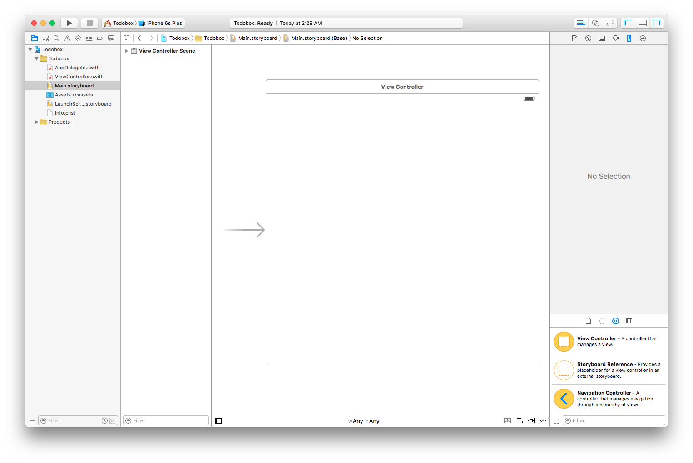

### 테이블 뷰 추가하기

1강에서 **Label**을 화면에 추가해본 적이 있죠? 이번에는 같은 방법으로 **Table View**를 화면에 끌어다 놓습니다. 유의할 점은, **Table View Controller**가 아니고 **Table View**여야 합니다. 바로 위에서 뷰 컨트롤러는 화면의 단위라고 했죠? *테이블 뷰 컨트롤러<sup>Table View Controller</sup>*는 테이블 뷰를 기본으로 가지고 있는 화면입니다.

우리는 기본으로 테이블 뷰를 가지고 있는 테이블 뷰 컨트롤러를 사용하는 대신에, 일반 뷰 컨트롤러에 테이블 뷰를 직접 추가할 거예요.

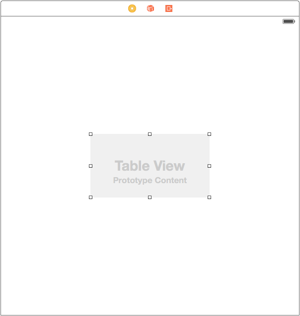

덩그러니 있으니 좀 허전하죠? 방금 추가한 테이블 뷰를 화면에 꽉 채워봅시다. 그리고 iPhone 7 시뮬레이터와 iPhone 7 Plus 시뮬레이터로 각각 실행해봅시다.


뭔가 다른 것을 느꼈나요? 만약 다른 점을 발견했다면 UI 개발자가 되기에 좋은 눈썰미를 가지고 있다고 볼 수 있겠습니다. 만약 발견하지 못했다면 발견한 척 합시다.

다른 점은 바로 테이블 뷰 크기가 화면 크기에 맞게 늘어나지 않았다는 점입니다. iPhone 7 시뮬레이터로 돌렸을 때에는 화면에 꽉 차던 테이블 뷰가, iPhone 7 Plus 시뮬레이터를 사용했더니 iPhone 7 영역만큼만 채워지고 화면 오른쪽과 아래쪽에는 공백이 생겨버렸습니다. 이 현상은 아이폰의 해상도가 다양해지면서 생겼습니다. 우리가 스토리보드에서 만들었던 테이블 뷰는 4.7인치 화면을 기준으로 크기를 정했기 때문에, 5.5인치 화면에서는 4.7인치짜리 테이블 뷰를 보게 되는 것이지요.

여러 해상도에 대응하기 위해 애플에서는 *오토 레이아웃<sup>Auto Layout</sup>*이라는 것을 만들었습니다. 어떤 뷰의 위치와 크기를 절대 수치로 직접 넣지 않고, 관계만을 정의하는 것이죠. 해상도가 다양해지기 전에는 테이블 뷰를 화면에 꽉 채우기 위해서 x, y 좌표를 (0, 0)으로 두고 가로와 세로 크기를 320과 480으로 뒀습니다. 하지만 오토 레이아웃이 사용되면서 부터는 상하좌우를 0으로 만들어버리는 방식을 사용합니다. 화면 위쪽까지의 거리가 0이고, 화면 아래쪽까지의 거리도 0이라면 이 뷰의 높이는 화면 높이와 같아지는 원리죠.

오토 레이아웃을 정의할 때에는 *제약<sup>Constraint</sup>*을 만듭니다. 상하좌우 거리를 0으로 만드는 제약을 테이블 뷰에 걸어버리는 것이죠. 스토리보드에서는 핀<sup>Pin</sup> 버튼(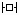)을 사용해서 오토 레이아웃 제약을 추가할 수 있습니다.

스토리보드에 있는 테이블 뷰를 선택한 뒤 핀 버튼을 클릭해봅시다. 그리고 왼쪽 그림처럼 나오는 값들을 오른쪽과 같이 모두 0으로 바꾸고, 상하좌우 점선을 클릭하여 실선으로 바꿔봅니다.

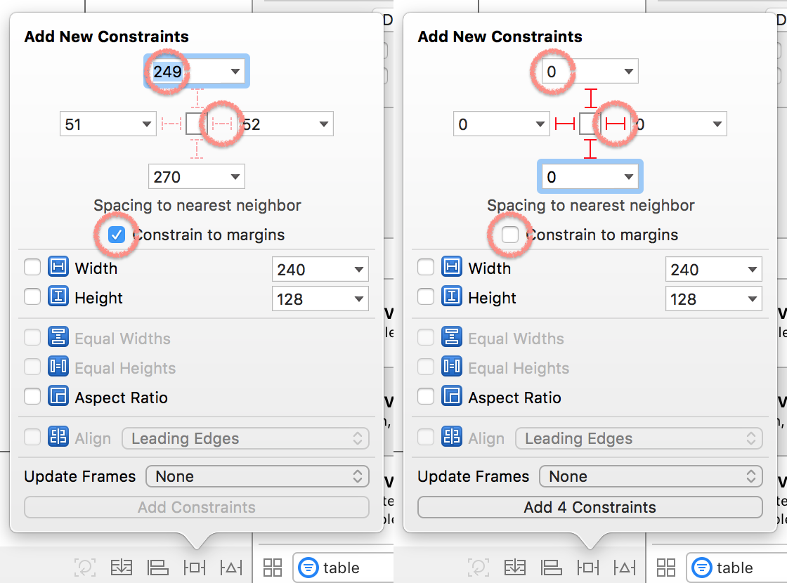

그 다음, 'Add 4 Constraints' 버튼을 선택하여 4개의 제약을 추가합니다. 상하좌우 모두 0으로 만들었는데, 각각 하나의 제약이기 때문에 총 4개의 제약이 됩니다. 오토 레이아웃 제약을 추가하면 스토리보드 왼쪽에 파란색으로 4개의 제약이 추가된 것을 확인할 수 있습니다.

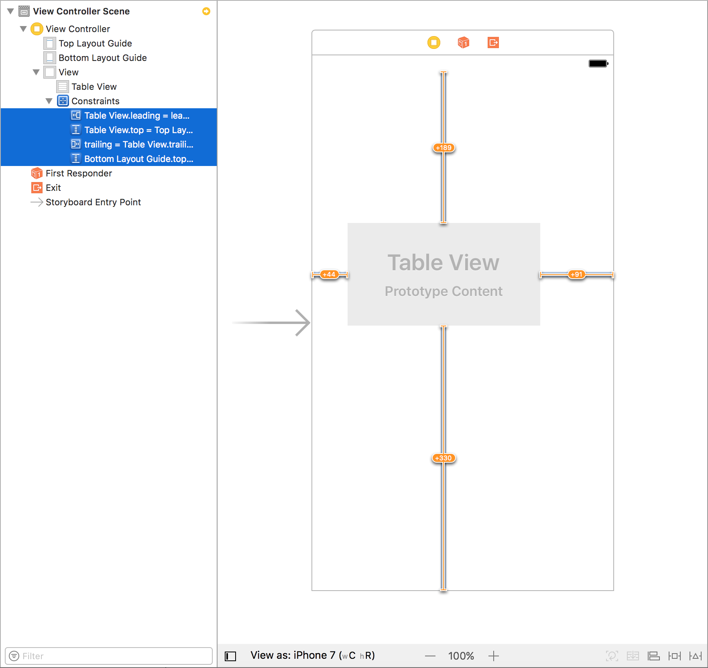

테이블 뷰 크기와 위치를 아무렇게나 조절해보면 노란색 줄이 생기는데요. 오토 레이아웃 제약에서는 상하좌우가 모두 0인데 스토리보드상 테이블 뷰의 좌표가 다르기 때문에 차이가 난다고 알려주는 것입니다. 이상태로 실행해도 정상적으로 작동되는데, 보고 있으면 찜찜하기 때문에 테이블 뷰를 선택하여 크기를 다시 늘려줍니다.

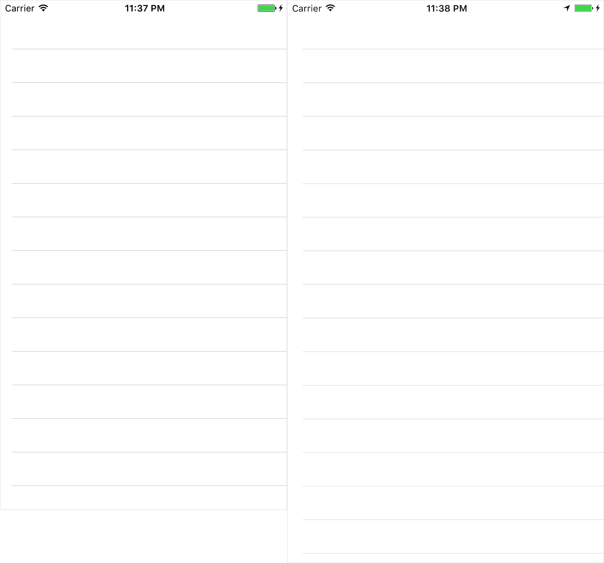

그리고 나서 아까와 같이 iPhone 7 시뮬레이터와 iPhone 7 Plus 시뮬레이터에서 각각 실행해봅시다. 이제 정상적으로 나오는 것을 볼 수 있습니다.

### 테이블 뷰를 코드와 연동하기

인터페이스 빌더에서 테이블 뷰를 추가했습니다. 인터페이스 빌더에서 추가한 것들을 작동하게 하려면 코드를 작성해야 하는데요. 이 테이블 뷰를 코드로 다루는 방법을 알아봅시다.

프로젝트 생성시 자동으로 만들어진 **`ViewController.swift`** 파일을 열어보면, `UIViewController`를 상속받은 `ViewController` 클래스가 있습니다. 미리 작성된 메서드가 있는데, 이 메서드는 우선 지워줍시다. 그리고 이 클래스에 `tableView` 속성을 추가해봅니다. 우리는 이 속성의 값을 스토리보드에서 불러올 것이므로, `ViewController` 클래스 생성시에는 값이 없지만 생성 직후에는 값이 연결될 것임을 알고 있습니다. 그렇기 때문에 `ImplicitlyUnwrappedOptional`로 선언을 합니다.

```swift
class ViewController: UIViewController {
  var tableView: UITableView!
}
```

인터페이스 빌더와 연결할 때에는 특별한 키워드를 하나 더 추가해야 합니다. 바로 `@IBOutlet`이라는 어트리뷰트입니다. `var` 앞에 붙여주면 돼요.

```swift
class ViewController: UIViewController {
  @IBOutlet var tableView: UITableView!
}
```

`@IBOutlet`을 붙이면 해당 라인의 바로 왼쪽에 아래 이미지와 같이 동그란 모양이 생기는 것을 확인할 수 있습니다.

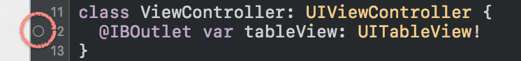

이 표시는 속성이 인터페이스 빌더와 연결되어 있는지를 나타냅니다. 만약 인터페이스 빌더에서 이 속성과 어떤 컴포넌트를 연결했다면 빈 동그라미 대신 속이 찬 동그라미가 나타납니다. 그럼 이제 동그라미를 채워봅시다.

**`Main.storyboard`** 파일을 인터페이스 빌더로 연 뒤, 아래 사진과 같이 따라해봅시다.

1. 테이블 뷰를 선택합니다.
2. 오른쪽 상단에서 Connections 설정을 선택합니다.
3. 'New Referencing Outlet' 항목의 오른쪽에 있는 동그라미부터 드래그를 시작합니다.
4. 인터페이스 빌더 왼쪽의 'View Controller' 항목까지 드래그한 뒤 놓습니다.

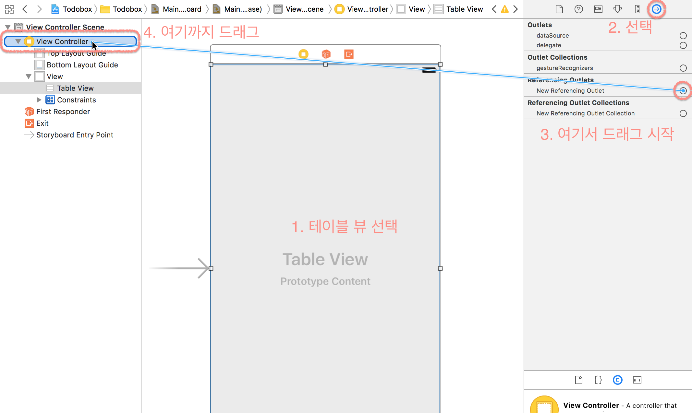

그럼 아래와 같이 'tableView'와 'view'를 선택할 수 있는 메뉴가 보여집니다. 각 항목은 `ViewController` 클래스에 `@IBOutlet`으로 선언된 속성들입니다. 우리는 'tableView'를 선택해서, 스토리보드의 테이블 뷰를 `ViewController`의 `tableView` 속성에 연결합니다.

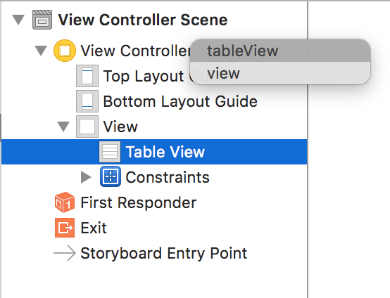

다시 **`ViewController.swift`** 파일로 돌아가보면, 아까 보았던 동그라미가 채워져있는 것을 확인할 수 있습니다.

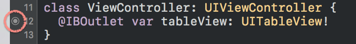

방금 우리는 스토리보드에서 추가한 테이블 뷰를 Swift 코드와 연결했습니다. 이제 코드로 연결한 테이블 뷰를 한 번 다뤄볼까요? 우선 `ViewController`에 `viewDidLoad()` 메서드를 만들어봅시다. 모든 뷰 컨트롤러들은 `view`라는 속성을 가지고 있습니다. `viewDidLoad()`는 `view`를 사용할 준비가 끝날 때 호출되기 때문에, `view`와 관련되거나 눈에 보이는 요소를 초기화 할 때에는 주로 이 곳에서 하곤 합니다.

우리는 우선 몸풀기로 `tableView`의 배경색을 바꿔주는 코드를 작성해봅시다. 아래와 같이 `backgroundColor` 속성을 `UIColor.red`으로 설정해볼까요?

```swift
class ViewController: UIViewController {
  var tableView: UITableView!

  override func viewDidLoad() {
    super.viewDidLoad()
    self.tableView.backgroundColor = UIColor.red
  }
}
```

테이블 뷰의 배경색이 잘 표시되나요? 잘 되는 것을 확인했으면 눈이 아프니 다시 원래대로 돌립시다. 그냥 몸풀기였으니까요.

### 테이블 뷰에 데이터 보여주기

이제 테이블 뷰에 데이터를 넣어볼 차례입니다. 테이블 뷰에 데이터를 넣기 위해서는 테이블 뷰가 어떻게 데이터를 받아오는지를 알아야 하는데요. 사실 몰라도 됩니다. 처음부터 모든것을 알려고 하면 머리가 아프고 코딩이 재미없어집니다. 잘 모르더라도 빨리 뭔가를 만들어보는게 더 중요합니다.

우리는 `ViewController` 클래스에 `UITableViewDataSource`라는 이름을 가진 프로토콜을 적용할 거예요. 이 프로토콜은 필수적으로 구현해야 하는 두 개의 메서드와, 선택적으로 구현이 가능한 여러가지 메서드를 정의하고 있습니다. 데이터를 보여주기 위해 필요한 두 개의 메서드는 다음과 같습니다:

```swift
// n번째 섹션에 몇 개의 row가 존재하는지를 반환합니다.
func tableView(_ tableView: UITableView, numberOfRowsInSection section: Int) -> Int

// n번째 섹션의 m번째 row를 그리는데 필요한 셀을 반환합니다.
func tableView(_ tableView: UITableView, cellForRowAt indexPath: IndexPath) -> UITableViewCell
```

이름이 되게 길죠? 그런데 앞으로 만날 대부분의 메서드들은 이름이 다 이렇게 깁니다. 이 두 개는 짧은 편에 속해요. 그러니 평소에 코딩을 많이 해서 타자 연습을 해야 합니다.

우선 첫 번째 메서드부터 구현을 해봅시다. 첫 번째 메서드는 특정 섹션에 몇 개의 row가 존재하는지를 반환하는 메서드입니다. 테이블 뷰는 섹션과 row로 구성되어 있어요. 테이블 뷰는 한 줄에 row 하나가 보여지고, row를 묶는 단위로 섹션을 사용합니다. 기본적으로는 하나의 섹션이 제공됩니다. 우리는 하나의 섹션만 사용할 것이기 때문에 `section` 파라미터를 비교해서 몇 번째 섹션인지를 체크하지 않습니다. 우선 무식하게 100개의 row가 있다고 한 번 써볼게요.

```swift
func tableView(_ tableView: UITableView, numberOfRowsInSection section: Int) {
  return 100
}
```

> **Note**: 여러 개의 섹션을 사용하려면, 아래 메서드를 구현하면 됩니다. 구현하지 않는 경우 기본값으로 `1`을 사용합니다.
>
> ```swift
> func numberOfSections(in tableView: UITableView) -> Int
> ```

그리고 하나의 메서드를 더 구현해야 컴파일이 가능해집니다. 이 메서드는 특정 row를 그리기 위해 필요한 셀을 반환합니다. 테이블 뷰에서 어떤 셀이 화면에 보이기 직전에 이 메서드가 호출됩니다. 만약 화면에 총 10개의 셀이 보인다면 이 메서드가 10번 호출되고, 테이블 뷰를 스크롤하여 새로운 셀이 보여질 경우 새로운 셀을 그리기 직전에 호출됩니다.

파라미터로 전달되는 `IndexPath`는 테이블 뷰에서 셀의 위치를 나타내기 위해 사용되는 일종의 인덱스인데요. `section`과 `row` 속성을 정의하고 있습니다. `IndexPath`의 `section`이 `0`이고 `row`가 `0`이라면 가장 위에 보이는 셀의 위치를 의미합니다. 우리는 바로 위에서 테이블 뷰에 총 100개의 row가 있다고 했으니, `indexPath.row`는 0부터 99까지가 될 수 있습니다.

```swift
func tableView(_ tableView: UITableView, cellForRowAt indexPath: IndexPath) {
  let cell = UITableViewCell()
  cell.textField?.text = "\(indexPath.row)"
  return cell
}
```

`UITableViewCell`은 테이블 뷰 셀을 의미합니다. 만약 커스텀 셀을 만들고 싶다면 이 클래스를 상속받아서 만들게 됩니다. `UITableViewCell`에는 기본적으로 `textField`라는 속성이 정의되어 있는데요. 이 값은 옵셔널로 정의되어 있습니다. 그렇기 때문에 우리는 옵셔널 체이닝을 사용해서 안전하게 값을 대입했습니다.

여기까지 한 뒤, 빌드하여 시뮬레이터에 올려봅시다. 아무것도 안나오죠? 사실 여기서 한 가지를 더 해야 합니다.
